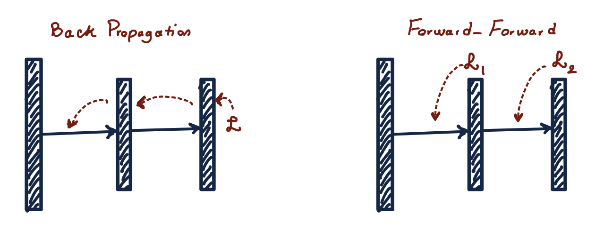
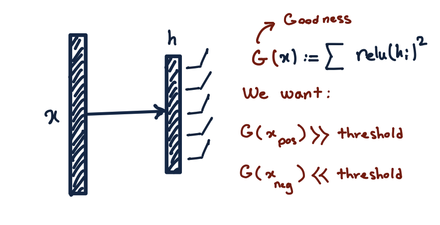
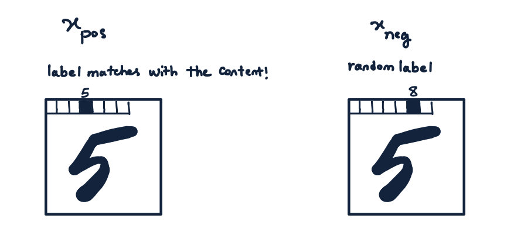

# pytorch_forward_forward
Implementation of forward-forward (FF) training algorithm - an alternative to back-propagation
---

Below is my understanding of the FF algorithm presented at [Geoffrey Hinton's talk at NeurIPS 2022](https://www.cs.toronto.edu/~hinton/FFA13.pdf).\
The conventional backprop computes the gradients by successive applications of the chain rule, from the objective function to the parameters. FF, however, computes the gradients locally with a local objective function, so there is no need to backpropagate the errors.



The local objective function is designed to push a layer's output to values larger than a threshold for positive samples and to values smaller than a threshold for negative samples.

A positive sample $s$ is a real datapoint with a large $P(s)$ under the training distribution.\
A negative sample $s'$ is a fake datapoint with a small $P(s')$ under the training distribution.



Among the many ways of generating the positive/negative samples, for MNIST, we have:\
Positive sample $s = merge(x, y)$, the image and its label\
Negative sample $s' = merge(x, y_{random})$, the image and a random label



After training all the layers, to make a prediction for a test image $x$, we find the pair $s = (x, y)$ for all $0 \leq y < 10$ that maximizes the network's overall activation.

With this implementation, the training and test errors on MNIST are:
```python
> python main.py
train error: 0.06754004955291748
test error: 0.06840002536773682
```
